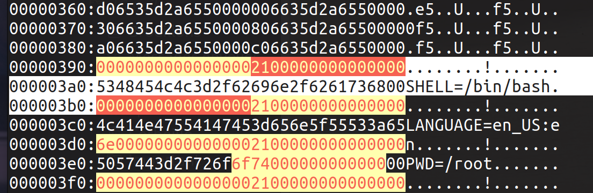

# phdtrack_project_3

A repo following the advancement of PhDTrack Project.

## Organisations

[SmartVMI.org](http://www.smartvmi.org/)

## repos

[Smart-and-Naive-SSH-Key-Extraction](https://github.com/smartvmi/Smart-and-Naive-SSH-Key-Extraction): code for bruteforce algorithms to extract SSH keys from OpenSSH.

[SSHKex](https://github.com/smartvmi/SSHKex): code for OpenSSH memory and internet traffic captation.

[smartvmi](https://github.com/smartvmi/smartvmi): Organisation GitHub repo

## datasets

[Zenodo dataset](https://zenodo.org/record/6537904): Data are dowloaded from [Zenodo](https://zenodo.org/record/6537904) inside the folder `../phdtrack_data` .

## Libs

[attrs](https://www.attrs.org/en/stable/index.html): lib for good Python OOP.

## Env

`conda env export --no-builds > ../environment.yml` : export conda env to yml file.

## Program usage

#### Calling the program

there are some flags to pass to the program.

`python src/main.py [FLAG]`: run the program

```shell
        python src/main.py [ARGUMENTS ...]

        Parse program arguments.
            -m model type (ml_structures.ModelType: RFC, GRID_SEARCH_CV)
            -b balancing type (ml_structures.BalancingType: NONE, OVER, UNDER)
            -t training dir path, path to the heap dump raw files
            -e testing dir path, path to the heap dump raw files
            -w max ml workers (threads for ML threads pool, -1 for illimited)
            -d debug
            -v vectorizing depth (influence the size of the feature vector)
            -h help
```

Example of usage:

```shell
python3 main.py -m GRID_SEARCH_CV -b OVER -t /home/onyr/Documents/code/phdtrack/phdtrack_data/Training/Training/scp/V_7_8_P1/16 -e /home/onyr/Documents/code/phdtrack/phdtrack_data/Validation/Validation/scp/V_7_8_P1/16 -d False -v 2
```

#### linux library needed

The library [graphviz](https://pygraphviz.github.io/documentation/stable/install.html) is needed to generate the image.

## Notes

PCAP file ? https://wiki.wireshark.org/Development/LibpcapFileFormat

### Get key in heap dump raw file from json data

To get a key in a given heap dump raw file, we can use its associated .json file. Each given key comes with its address as an hex number. However, the raw heap dump lines of hex memory starts at address 0x0, whereas the address in the json are given relative to the real memory address in the sampled data. As the address of the start of the head dump file (0x0) is given from real memory (`"HEAP_START": "55a6d2356000"`), we can compute the

Example: *302-1644391327.json*address given relative to the raw file (given_json_key_addr - HEAP_START).

```
{
    "KEY_A_ADDR": "55a6d236ba10", 
    "KEY_A_LEN": "16", 
    "KEY_A_REAL_LEN": "16", 
    "KEY_A": "8d08ff65b3bfcd8b91ca995ad5b764af",
    "HEAP_START": "55a6d2356000"
}
```

computation: addr in file = 55a6d236ba10 - 55a6d2356000 = **15A10**

Searching for **15A10** in vim: `/15a10`: Open vim with `vim 302-1644391327-heap.raw`, parse the raw bytes with `xxd` usinf vim command `:%!xxd`, and the search for pattern with `/pattern`, here `/15a10`.

> tips: to ease the search for patterns in vim, remove the whitespaces created by `xxd` with the vim command: `:%s/\s\+//g`

> WARNING: `xxd` addresses are presented as addresses of the first byte of a given line ! So addresses are incremented from one line to another by leaps of 16. This is coherent with the storing of addresses in memory (json file addresses).


#### search for pointers

Using vim regex, run `:%!xxd`, then `:%s/\s\+//g`, then search for pointers with: `:/[0-9a-f]\{12}0\{4}`.

> WARN: The pointers in the raw heap dump files are coded using LITTLE-ENDIANNESS. They are coded as 8 byte-aligned memory blocks.

> 8 bytes means 16 chars!

Example of potential pointers from `.1010-1644391327-heap.raw`:

```shell
00000300:20947e968b55000040947e968b550000.~..U..@.~..U..
00000310:60947e968b55000080947e968b550000`.~..U....~..U..
00000320:a0947e968b550000e0947e968b550000..~..U....~..U..
00000330:00957e968b55000020957e968b550000..~..U...~..U..
00000340:40957e968b55000070957e968b550000@.~..U..p.~..U..
00000350:90957e968b550000b0957e968b550000..~..U....~..U..
```

Those are pointers in range.

##### determine pointer range

> WARN: `HEAP_START` from associated json file is in big endian!!!

To determine the valid pointer, one need to check that the pointer points to a reachable address, within the program heap range. Just determine the number of bytes in the heap dump, and use associated JSON file `HEAP_DUMP` values in order to compute the range.

#### Search for datastructures

Data structures starts with the number of bytes allocated (in heap).

Search for memalloc headers `:/[0-9a-f]\{4}0\{12}`.



Here you can see a 4x16 char blocks which represents a data structure of 32 bytes ((4x16)x4)/8. The value `2100000000000000` is the malloc header in little endian format which represents 33. It is probably the number of bytes to leap through to avoid this data strucure.

##### example of potential datastructure

```shell
00000230:00000000000000000000000000000000................
00000240:00000000000000000000000000000000................
00000250:00000000000000002100000000000000........!.......
00000260:73736864000000000000000000000000sshd............
00000270:00000000000000002100000000000000........!.......
00000280:a06235d2a6550000c06235d2a6550000.b5..U...b5..U..
00000290:00000000000000002100000000000000........!.......
000002a0:2f746d702f7373686400000000000000/tmp/sshd.......
000002b0:00000000000000002100000000000000........!.......
000002c0:2d520000000000000000000000000000-R..............
000002d0:0000000000000000c100000000000000................
```

#### Organisation of memory in heap dump files

##### start of file

As we can see, raw heap dump files all starts with a null block (blocks are of size 8 bytes (16 chars "0" using `vim`)). Then we call always see a malloc header of size `5102` (little-endian, equivalent to 593). This is probably the master data structure being allocated.

##### max memalloc size

Long story short, there is probably no max size. More info [here](https://stackoverflow.com/a/57687432/10798114). On my PC, we got:

```shell
(base) onyr@aezyr:~$ sudo cat /proc/sys/vm/overcommit_memory 
[sudo] password for onyr: 
0

```

Meaning there is no limit to memalloc.

### Our graph representation

We have choosen to represent data structures using a root node called DataStructureNode. This node is just for representation, and its address it the address of the memalloc, which is not reachable by the C pointers.

So, a pointer that points to a data structure actually points to the block immediatly after the DataStructureNode. This can be any type of node exclusing DataStructureNode since a data structure is composed of at least one non memalloc header block.

This means that our corrected representation represent pointers that points to the first node after the DataStructureNode as actually pointing to the DataStructureNode instead. We do not loose information this way, as any pointer that would point to a DataStructureNode would be known to actually points to the node immediatly after.

> WARN: The addresses of data structures in the JSON, for instance SSH_STRUCT_ADDR, actually refer to the address of a pointer that points to the data structure (not necessarily directly).

#### ML model engineering

We want to optimize the **recall** first. More info [here](https://inside-machinelearning.com/en/recall-precision-f1-score-simple-metric-explanation-machine-learning/). We want our model to detect every occurence of possible keys, without missing any potential key. This means we want an ideal **False Negative** value of 0, i.e. we want that our model detects all the keys.

## Questions

* [X] What is `SSH_STRUCT_ADDR` and `SESSION_STATE_ADDR`
* [X] Why we don't find `SESSION_STATE_ADDR`?
* [X] Discuss access to a big machine with CPU power and a LOT of RAM

### Meeting - Fri 17th 2023

These are the next steps for the project

* [ ] A LOT of refactoring. Compress the pointer representation within weight of edges. We are only interested in the relationship between data structures.
* [ ] Feature engineering: find the most significative features and their related hyper-parameters.

  * [ ] allocation size in the DTN
  * [ ] offset in the DTN (position of the value node inside the DTN)
  * [ ] number of PN and VN in DTNs
