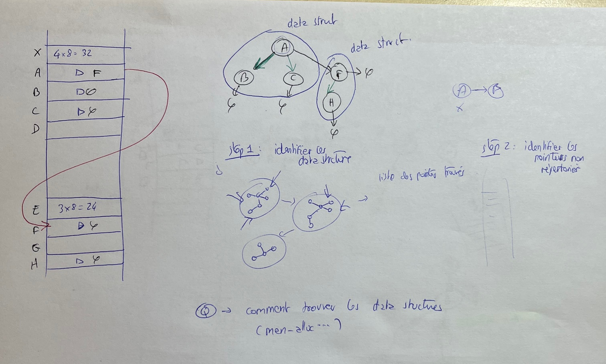
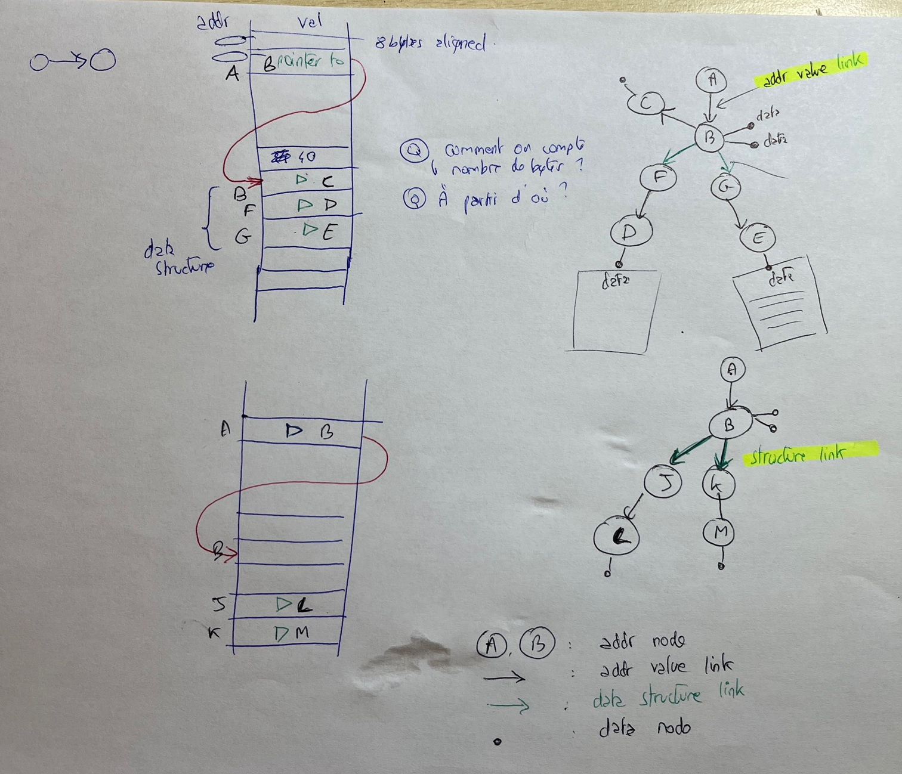

# Worklog

## Meetings

### Meeting - Fri 17th 2023

These are the next steps for the project

* [ ] A LOT of refactoring. Compress the pointer representation within weight of edges. We are only interested in the relationship between data structures.
* [ ] Feature engineering: find the most significative features and their related hyper-parameters.

  * [ ] allocation size in the DTN
  * [ ] offset in the DTN (position of the value node inside the DTN)
  * [ ] number of PN and VN in DTNs

## Work

### Wed 22th mar 2023

Restarted to work on the project. Clément added some code and a Logger, but a lot of debugging is needed.

Rust improvements

* [ ] Compute number of nodes (VN and PN) just after creation of a DTN node.


### Sat 25th feb 2023

* [ ] beautify graph representation

### Fri 24th feb 2023

* [X] begining the implementation of simplification of the graph
* [X] debugging the simplification of the graph

### Tue 21th Feb 2023

* [X] finishing and debuging the logging

### Mon 21th Feb 2023

To make the casual logging, use RotatingFileHandler ([here](https://stackoverflow.com/questions/40088496/how-to-use-pythons-rotatingfilehandler)).

* [X] refactoring and clean code
* [X] beginning the implementation of logging

### Fri 17th Feb 2023

We have ideas for many improvements. We have worked on the high recall training pipeline, as well as other refactoring stuff. We have added an command line argv parser.

* [ ] create a training and testing log system, to keep track of both result, but ESPECIALLY training parameters. The number of samples is missing ! create a proper logger, using the standard library of Python. At least 2 loggers are necessary. Both loggers write to the terminal. One logs all messages to rotating log files (can use 20 files of 50Mb), the other log 1 file per model evaluation (1 eval == 1 file), including training and testing params, file number, depth, provenance of files...
* [X] add exe command line flags to control training and testing.
* [ ] new potential features "ValueNode position" and "related data structure size". Note that we think that adding such features is possibly wrong, since our approach tries to hide any information about the addresses, including address ordering. This can also affect the generality of the model, since the size of the keys, hence the ordering and position of keys in heap dump block may differ and surspecialize the model.
* [ ] refactor the code (depht to file name), ...
* [ ] Investigate why the samples and labels generation is so slow. Idea: limit the number of simultaneous thread, we think we are RAM memory bound... We have already made a lot of refactoring
* [X] make another classifier with high recall
* [ ] make bigger model (use more data).

### Thu 16th Feb 2023

We debugged the ML training process and added multi-threading to both the loading/generation of samples and lables, and the classifier fitting. We also did a lot of refactoring around the data loading pipeline.

* [X] debug ML training
* [X] Start working on ML detection of keys
* [X] find how to vectorize graph or node
* [X] pipeline for the model evaluation
* [ ] refactor the code (depht to file name), ...
* [ ] Investigate why the samples and labels generation is so slow. Idea: limit the number of simultaneous thread, we think we are RAM memory bound...
* [ ] make another classifier with high recall
* [ ] make bigger model (use more data).
* [ ] add exe command line flags to control traning and testing.
* [ ] create a proper logger, using the standard library of Python. At least 2 loggers are necessary. Both loggers write to the terminal. One logs all messages to rotating log files (can use 20 files of 50Mb), the other log 1 file per model evaluation (1 eval == 1 file), including training and testing params, file number, depth, provenance of files...

### Wed 15th Feb 2023

We discovered a problem with pointers pointing to data structures, since they do not really points to the data structure malloc header (DataStructureNode), but instead, to the first block after it. This means our current representation is wrong and do not make possible to really understand links between data structures.

The data structures addresses given in the JSON file are neither the malloc header address of the data stucture nor the first block after a malloc header. It is in fact the address of a pointer pointing to the data structure!

* [X] Refactor the PointerNode and ValueNode classes.
* [X] Correct graph representation
* [X] Correct JSON data annotation
* [ ] debug ML training
* [ ] Start working on ML detection of keys
* [ ] find how to vectorize graph or node

##### About Node Embedding and Feature Engineering

[Introduction to Node Embedding](https://memgraph.com/blog/introduction-to-node-embedding) ⭐️

[Graph Embeddings: How nodes get mapped to vectors](https://towardsdatascience.com/graph-embeddings-how-nodes-get-mapped-to-vectors-2e12549457ed)

[Graph Embeddings — The Summary](https://towardsdatascience.com/graph-embeddings-the-summary-cc6075aba007)

[neo4j graph embeddings](https://neo4j.com/docs/graph-data-science/current/machine-learning/node-embeddings/)

[scikit-network](https://scikit-network.readthedocs.io/en/latest/index.html)

Because we are working on a custom graph, representing a precise data structure, we think that rely on **Random Walk based** or **Deep Learning based** will not preserve enough the specificities of the graph we have. So the best idea now is to do some Feature Engineering to generate our own node vector representation that we can easily label. Because what we want to predict is just the address of the key, and because the keys are of different possible lenght, we will only keep the address of the first block.

* [X] Refactor KeyNode, so that when we keep it for visualization step, but we need not to remove the other ValueNodes, the non-first key data ValueNodes. We want our ML model to find only the KeyNode, i.e. the address of the first block of the keys.
* [X] create pipeline for embedding
* [ ] create training ML pipeline
* [ ] create ML evaluation pipeline

Features idea, for ValueNodes only

* number of input ancestor node, by type, of a given depth. The depth is an hyper-param. Considering the relative small size of the structure, a small int, like 5 or 10 should be enough. This representation take in consideration the very directive structure of the graph.

### Tue 14th Feb 2023

We started to try to visualize our first results concerning the data structure generation. To do so, we tried different softwares (see potential DOT visualizers [here](https://stackoverflow.com/questions/3433655/free-visual-editor-for-graph-dot-files) and [here](https://linuxhint.com/kgrapheditor-linux/)), but most of them are broken. We then generated directly a visualization using the following command line:

```shell
sfdp -Gsize=67! -Goverlap=prism -Tpng 467-1644391327-heap.gv > 467-1644391327-heap-sfdp.png
```

This uses directly Graphviz, more info [in the doc](https://graphviz.org/Gallery/undirected/root.html), other types of visualizations [here](https://graphviz.org/gallery/).

New types:

* [ ] Link json data to our rebuild datastructures:
* [X] get JSON key addresses and lenghts
* [X] get key structures from JSON
* [ ] get encoding string data and make custom representation
* [ ] match all data with generated graph
* [X] make beautiful colored graph, refactor graph edge annotations
* [ ] link C code structures to our rebuilt data structures

ML thinking: Now that we have our annoted graph, we need to feed it to a ML model. We could for instance find a vector representation for each node of the graph, annotate it, then feed that to the model, and see the results.

The problem is that we have an imbalaced dataset with very few positive values. We need to filter out useless structs to limit the number of nodes.

### Mon 13th Feb 2023

We restarted to work on the project. We are currently implementing the data structure detection and recreation loop.

We DO NOT CURRENTLY works on the edges outside of datastructures (we don't follow the pointers yet).

* [X] Test current code.
* [X] Need to do step 2: follow the pointers

We then debugged and worked on the step two: following the pointers identified inside the data structures. If the pointers points to already discovered nodes inside data structures, we plot them, otherwise, we create new nodes and follow them if they are pointers.

* [ ] Need to further test step 2

### Tue 31th Jan 2023

look at malloc headers (in little endian format) to determine the lenght (number of block)

graph -> generate representation

* [ ] Finish to refactor the python module
* [ ] Use NetworkX to generate and [display graphs](https://networkx.org/documentation/stable/reference/drawing.html#module-networkx.drawing.nx_agraph)
* [ ] Create functions to identify data-structures and lonely pointers (see pictures)

Data representation to implement: The idea is to try to follow all possible datastructures.





The firtst node of a structure is a blank node. It represents the first byte block after the malloc header. It can be a piece of data or a pointer. Other pointers inside the data structures are linked to this blank node via *data structure link.*

### Thu 26th Jan 2023

Started to think about the new representation of memory data structures into a graph representation.

Read SSHkey_vm_introspection, and looking at [OpenSSH-Portable](https://github.com/openssh/openssh-portable). Here are our notes:

[packet.h](https://github.com/openssh/openssh-portable/blob/master/packet.h) contains `struct ssh`:

* 14 pointers
* 4 int

[packet.c](https://github.com/openssh/openssh-portable/blob/master/packet.c) contains `struct session_state`:

* 13 pointers
* 17 int
* 4 `u_int`
* 1 `u_int64_t`
* 1 `u_int32_t`
* 1 `time_t`
* 1 `u_char`
* 1 `size_t `

> There is a pointer from `ssh` to `session_state`

[kex.h](https://github.com/openssh/openssh-portable/blob/master/kex.h) contains `struct newkeys`:

```c
struct newkeys {
	struct sshenc	enc;
	struct sshmac	mac;
	struct sshcomp  comp;
};

```

sshenc:

* 4 pointers
* 1 `int`
* 3 `u_int`

sshmac inside [mac.h](https://github.com/openssh/openssh-portable/blob/master/mac.h):

* 4 pointers
* 3 `int`
* 2 `u_int`

sshcomp:

* 1 pointer
* 1 `u_int`
* 1 `int`

We suppose the top level struct contains the sum of all bytes of its sub-structures.

We also spent some time to investigate who are currently maintaining and extending this project. It is 4 google engineer since 1999 : [Damien Miller](https://www.linkedin.com/in/djmdjm/), [Darren Tucker](https://www.linkedin.com/in/dtucker/), [Markus Friedl](https://www.linkedin.com/in/markus-friedl-6709861/), [Niels Provos](https://www.linkedin.com/in/nielsprovos/)

### Wed 25th Jan 2023

Started to look at the advanced graph generation. Lot's of work to do:

* [ ] Complete pointer to pointer data structure linking, using `malloc` data store before pointed value.
* [ ] Transition from DOT graph generation to NetworkX.

### Thu 19th Jan 2023

We worked on displaying the graph of pointers. We removed unique-vertice graphs. We tried to check what the pointed data.

* [ ] Refactor functions out of Notebook
* [ ] Fix graphviz strange " error
* [ ] Fix utf-8 incorrect formatting.

### Tue 17th Jan 2023

Finally corrected the pointer extraction script. Pointers are coded using LITTLE-ENDIAN ordering.

* [X] Graphs generated are too big. Need to remove 1, or 2 nodes graphs. Refactoring needed.

### Mon 16th Jan 2023

Trained a high recall SVC classifier using cross validation and grid search.

### Sun 15th Jan 2023

Started to build a script to get pointers from raw heap dump files.

### Sat 14th Jan 2023

Working on obtaining Keys from raw heap dump files. Trained new classifiers from dataset.

### Fri 13th Jan 2023

Started to look at raw data using Okteta, which is a hex viewer to view the data. Install on Fedora with `sudo yum install okteta`. I have tried to see if I could locate the keys manually using Okteta without success.

* [X] How to find the keys in Okteta? Okteta broken, use VIM and `:` then `%!xxd` to search for patterns and bytes.
* [X] How to search the HEAP_START? I can't find it in Okteta?
* [ ] How to create a dataset from the given data files?
* [ ] Where are the `-key.log` files necessary for training? Do we need to adapt the code to works with the provided `.json` files instead?
* [ ] Follow the pointers in mem and create a DOT graph with a Python script. Use .json solutions as starting point.

Questions ?

* [X] How to use create_dataset(), and create_splits...
* [X] where are the -key.log (-> try to generate them to test)
* [ ] Why is the no `basic` in `TYPES = ["client-side", "dropbear", "OpenSSH", "port-forwarding", "scp", "normal-shell"]` (constants.py), whereas there are folders called `basic` from Zenodo datasets. Same for \`client` ?

### Thu 12th Jan 2023

Finished baseline of heavy refactoring. Original code working in both DEPLOY and non DEPLOY mode.

* [ ] Use and modify `train_classifier` to work with different classifiers. Continue to work on the testzone.

### Wed 11th Jan 2023

Restarted to work on PhDTrack project. Reread documents and research materials. Continuing to work on code refactoring.
