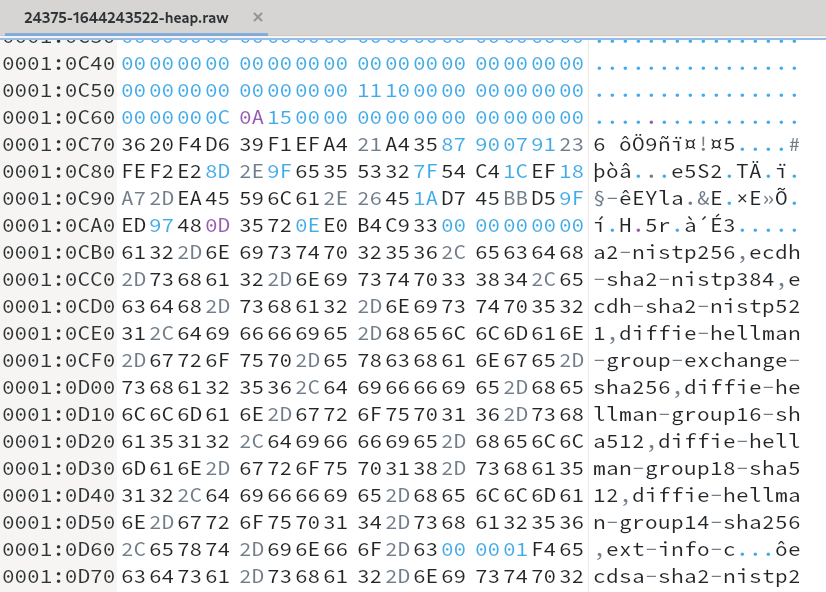

# Heap data

### Useful links

[Okteta hex viewer](https://userbase.kde.org/Okteta): a cool and simple hex viewer for KDE. Install on Fedora with `sudo yum install okteta`.


## Notes

We are given lots of raw heap memory data as raw hex files.



Each file is accompanied by another `.json` file which contains keys and additional informations. 

*24375-1644243522.json*

```json
{
  "ENCRYPTION_KEY_NAME": "aes128-ctr",
  "ENCRYPTION_KEY_LENGTH": "16",
  "KEY_C": "689e549a80ce4be95d8b742e36a229bf",
  "KEY_D": "76788e66a56d2b61eec294df37422fcb",
  "HEAP_START": "5589d41e0000"
}
```

Q?: I can't find the key in Okteta ?!

Q?: How to search the HEAP_START ? I can't find it in Okteta.
