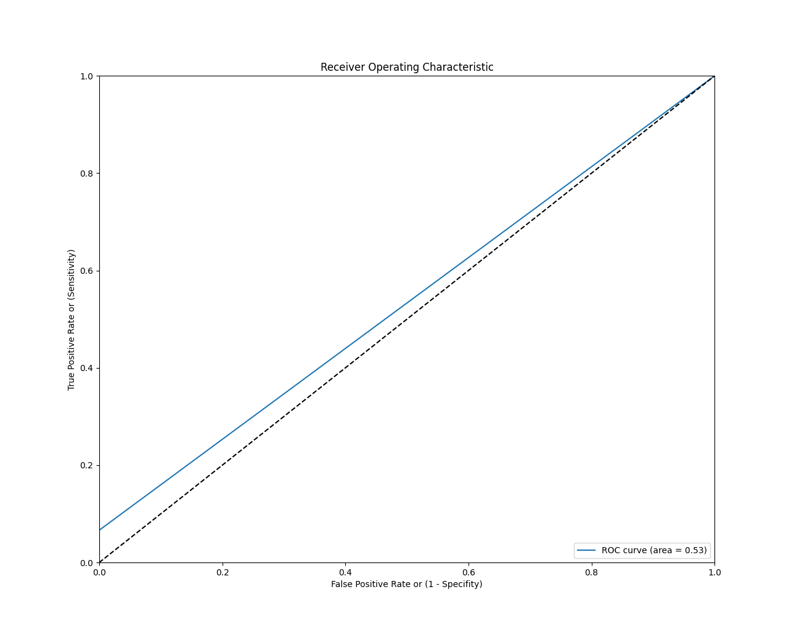

# ML results

## Fri 17th Feb 2023

Here are results on the training and testing of a RandomForestClassifier called `random_forest_classifier_1_depth_5.pkl`, trained over `samples_and_labels_training__depth_5_Training_scp_V_7_8_P1_16.pkl` and tested over `samples_and_labels_testing__depth_5_Validation_scp_V_7_8_P1_16.pkl`.

```
Accuracy: 99.96%
              precision    recall  f1-score   support

           0       1.00      1.00      1.00   2356984
           1       1.00      0.07      0.12      1070

    accuracy                           1.00   2358054
   macro avg       1.00      0.53      0.56   2358054
weighted avg       1.00      1.00      1.00   2358054

Confusion Matrix: 
 [[2356984       0]
 [    999      71]]
True Positives:  71
True Negatives:  2356984
False Positives:  0
False Negatives:  999
AUC: 0.53
```



ROC curve shows results are aweful :c .

### New training on depth 8

```
Accuracy: 99.96%
              precision    recall  f1-score   support

           0       1.00      1.00      1.00   2356984
           1       1.00      0.07      0.12      1070

    accuracy                           1.00   2358054
   macro avg       1.00      0.53      0.56   2358054
weighted avg       1.00      1.00      1.00   2358054

Confusion Matrix: 
 [[2356984       0]
 [    999      71]]
True Positives:  71
True Negatives:  2356984
False Positives:  0
False Negatives:  999
AUC: 0.53
```

![ROC curve]{./img/random_forest_classifier_1_depth_8__2023_02_17_10_04.png}
